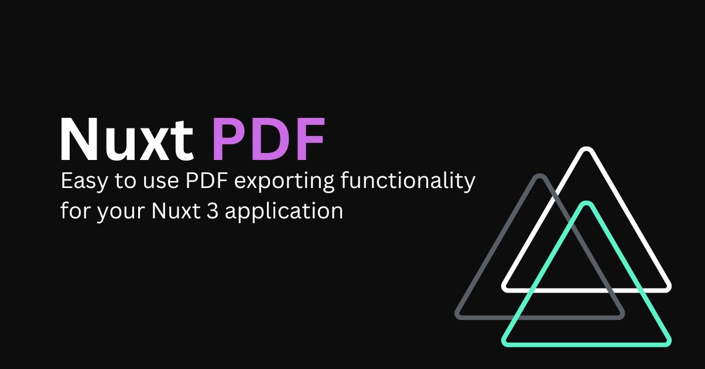

# 📄 nuxt-pdf

[![npm version][npm-version-src]][npm-version-href]
[![npm downloads][npm-downloads-src]][npm-downloads-href]
[](https://GitHub.com/sidebase/nuxt-pdf/)
[![License][license-src]][license-href]
[](https://twitter.com/sidebase_io)
[](https://discord.gg/NDDgQkcv3s)

> `nuxt-pdf` is a easy to use, pdf exporting module to convert Nuxt 3 components into downloadable PDFs.

## Quick Start

```sh
npm i -D @sidebase/nuxt-pdf
```

Then visit the [Quick Start documentation](https://sidebase.io/nuxt-pdf/getting-started/quick-start) to setup the module.

## Features

- Easily export your Nuxt 3 components into PDFs
- Guides for PDF specific styles
- Track exporting progress

### Module Playground

This module also has it's own playground:
```sh
> git clone https://github.com/sidebase/nuxt-pdf

> cd nuxt-pdf

> npm i

> npm run dev:prepare

> npm run dev

# -> open http://localhost:3000
```

<!-- Badges -->
[npm-version-src]: https://img.shields.io/npm/v/@sidebase/nuxt-pdf/latest.svg
[npm-version-href]: https://npmjs.com/package/@sidebase/nuxt-pdf

[npm-downloads-src]: https://img.shields.io/npm/dt/@sidebase/nuxt-pdf.svg
[npm-downloads-href]: https://npmjs.com/package/@sidebase/nuxt-pdf

[license-src]: https://img.shields.io/npm/l/@sidebase/nuxt-pdf.svg
[license-href]: https://npmjs.com/package/@sidebase/nuxt-pdf
